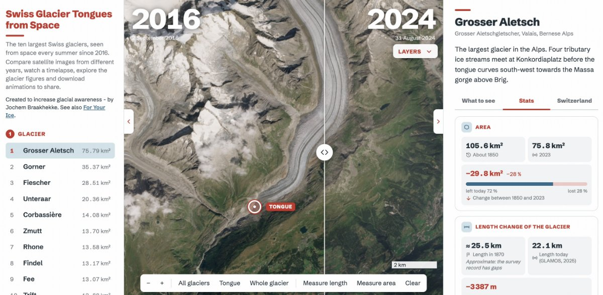

# Tongues from Space - Switzerland

**The ten largest Swiss glaciers, seen from space every summer since 2016. Compare satellite images from different years, create timelapses, explore the glacier figures and download animations to share.**

Live site: https://braakhekke.github.io/tonguesfromspace/

A glacier ends in its tongue, the lowest stretch of ice, where it melts the most. That is where change is easiest to see: every summer the tip pulls back and leaves bare rock, a lake or a new valley floor. This project puts those pictures first, next to the glacier figures and what the melted ice means in water, because a before-and-after image is understood at once and remembered.

It is built by [Jochem Braakhekke](https://github.com/braakhekke) to increase glacial awareness, and it is open source: **you are welcome to help build it, or to make a dashboard like it for glaciers in your own country or region.** See [Contributing](#contributing) and [Make your own version](#make-your-own-version-for-another-region).



## What it does

- **Satellite images:** for every glacier and year, the clearest late-summer Sentinel-2 scene (best September scene, otherwise August, otherwise July), scored for cloud and snow cover.
- **One year, Compare, Timelapse:** look at a single year, swipe between two years, or play a range of years.
- **Colours:** Natural, False 1 (infrared) and False 2 (snow and ice in red; experimental), each with a plain-language note.
- **Glacier figures:** area since 1850, length and length change from the first survey, and the ice and water stored in each glacier (litres, Olympic pools, Lake Zurich).
- **Switzerland as a whole:** ice left since 2016, ice lost per year, and how much water that is.
- **Map tools:** outlines of 1850 and 2023, a tongue indication, measuring of lengths and areas, background layers.
- **Download image and animation:** one picture, a timelapse or a slider as JPEG or MP4 for Instagram, TikTok and others (9:16 following Instagram's safe zones, or 4:5). Made in the browser.
- **Share:** a link to the current glacier, mode and years.

Everything the page does runs in the visitor's browser. There is no database and no build step: the site is one `index.html`.

## How it works

```
 visitor's browser ──► index.html + glaciers.js              (GitHub Pages)
        │
        └─ satellite requests ──► relay ──► Copernicus Data Space (Sentinel Hub APIs)
                                   │
              Cloudflare Worker (public site)  or  scripts/serve.py (your computer)
```

- **Scene choice:** one Statistical API request per glacier and summer scores every Sentinel-2 L2A acquisition for cloud and snow (scene classification). The best day is then rendered from Sentinel-2 L1C with the Copernicus Browser true colour process.
- **Why a relay:** Copernicus needs a login, and browsers cannot log in to it directly. The relay holds one OAuth client, forwards only the two request types the dashboard makes, and caches the answers. Visitors need no account.
- **Glacier data:** `scripts/build_outlines.py` downloads the Swiss Glacier Inventories and length-change series from GLAMOS, ranks the glaciers, finds each tongue tip, and writes `glaciers.js`. A GitHub Action runs it monthly.
- **Caching:** the browser keeps the scenes and images it has fetched in IndexedDB (images capped at 150 MB); the Worker keeps answers in Cloudflare KV.

| Path | What |
|---|---|
| `index.html` | The whole dashboard (HTML, CSS and JavaScript, Leaflet from a CDN) |
| `glaciers.js` | Generated by the build script; do not edit by hand |
| `scripts/build_outlines.py` | Downloads GLAMOS data, writes `glaciers.js` (Python standard library only) |
| `scripts/serve.py` | Local web server plus Copernicus relay for development |
| `worker/worker.js` | Cloudflare Worker: the public relay, with request checks, caching and a fair-use limit |
| `.github/workflows/deploy.yml` | Builds the data and publishes the site on GitHub Pages |
| `fonts/`, `images/` | Self-hosted font (SIL OFL) and the pictures used by the page |
| `experiments/` | Parked work (not part of the site) |
| `CLAUDE.md` | Notes on the code for developers and AI assistants |

## Run it on your computer

You need Python 3 and a free Copernicus Data Space account.

1. In the [CDSE dashboard](https://shapps.dataspace.copernicus.eu/dashboard/) open *User settings → OAuth clients* and create a client. Note its ID and secret.
2. In the repository folder run:

   ```bash
   python3 scripts/serve.py        # then open http://localhost:8000
   ```

   It asks for the client ID and secret (or reads `CDSE_CLIENT_ID` and `CDSE_CLIENT_SECRET`, or `scripts/.cdse-credentials`, which is git-ignored).
3. To refresh the glacier data: `python3 scripts/build_outlines.py`.

Use `http://localhost:8000` and not another address if you want to use a deployed Worker instead: the Worker only accepts the origins it is configured with.

## Publish your own copy

1. **GitHub Pages:** fork the repository, then *Settings → Pages → Source: GitHub Actions*, and run the workflow *Build data and deploy* from the Actions tab.
2. **Relay (free):** create a Cloudflare Worker from `worker/worker.js`; add your OAuth client as the secrets `CDSE_CLIENT_ID` and `CDSE_CLIENT_SECRET`, a text variable `ALLOWED_ORIGINS` (your site address, plus `http://localhost:8000` for development), and optionally a KV namespace bound as `CACHE`. Check `…/cdse/ping`.
3. **Connect:** in the GitHub repository add the variable `CDSE_RELAY_URL` (the Worker address) and run the workflow again.

For a strict limit against misuse, add a Cloudflare rate-limiting rule for the path `/cdse/`. Please check that the [Copernicus terms](https://dataspace.copernicus.eu) allow serving a public website from one account before you launch.

## Make your own version for another region

The imagery part works anywhere Sentinel-2 does. The Swiss parts are the data sources and a few limits. To adapt it:

1. **Pick your glaciers and a national or regional inventory.** Replace the GLAMOS downloads in `scripts/build_outlines.py` with your inventory (outlines and areas), and with a length-change series if one exists for your region. Many countries publish inventories; the global Randolph Glacier Inventory and GLIMS are alternatives.
2. **Area limits:** in `worker/worker.js` change the bounding box `SWISS` to your region. In `index.html` update `SWISS_VIEW`, the built-in glacier list `DEFAULTS` and the `GLACIER_INFO` texts. Only write facts you can source.
3. **Season:** the page looks for the clearest scene between 1 July and 20 September (`CDSE.months`, `LAST_DAY`). In the southern hemisphere or the tropics choose the end of your melt season instead, and change the matching date checks in the Worker.
4. **National figures:** the Switzerland tab uses yearly ice loss and total ice volume from GLAMOS and SCNAT (`VOLUME_LOSS`, `ICE_2024`). Replace them with your own source or remove the tab.
5. **Texts and credits:** the About chapter, sources list and credits line must list your data.

Open an issue if you get stuck. I would be glad to hear about a dashboard for another region and to link to it.

## Contributing

Contributions are welcome: bug reports, ideas, translations, glacier texts with sources, or code. Please open an issue first for larger changes. A few ground rules:

- **Only documented facts.** Every figure and text about a glacier needs a source. If the origin of a name or a number is unknown, say so.
- **Keep it calm and compact:** little text, details behind small "i" buttons or in the About chapter.
- **No CSS or SVG filters on page elements for image effects** (Safari on iPhone ignores them); process pixels in a canvas.
- **After changing how scenes are scored or rendered,** raise `CDSE.version` in `index.html` so browsers drop old images.
- Test locally with `scripts/serve.py`. `CLAUDE.md` describes the structure of `index.html` and a test checklist.

Things that would help: more glaciers and regions, translations, verified glacier texts, and testing on real iPhones and in Safari.

## Data sources and licences

- **Imagery:** Copernicus Sentinel-2 L1C and L2A via the Copernicus Data Space Ecosystem. Contains modified Copernicus Sentinel data. Free for any use with attribution.
- **Glacier areas and outlines:** GLAMOS Swiss Glacier Inventories 1850, 1973 and 2023, CC BY 4.0.
- **Length change:** GLAMOS (2025), Swiss Glacier Length Change, release 2025, doi:10.18750/lengthchange.2025.r2025. Free for scientific and **non-commercial** use with the source indicated. The length today is read from the GLAMOS figure [lc_stat_frequency](https://doi.glamos.ch/figures/lc_stat_frequency.pdf).
- **Yearly volume loss:** GLAMOS and the Swiss Academy of Sciences (SCNAT) annual glacier reports.
- **Ice thickness and volume per glacier:** Grab et al. (2021), Journal of Glaciology 67(266), via the swisstopo map service.
- **Water use:** SVGW water statistics.
- **Background:** Sentinel-2 cloudless 2024 by EOX IT Services GmbH ([s2maps.eu](https://s2maps.eu)), CC BY-NC-SA 4.0. **Base map and place labels:** © OpenStreetMap contributors.
- **Font:** Schibsted Grotesk, SIL Open Font Licence 1.1 (`fonts/OFL.txt`).

## Licences

The project has three kinds of content, each with its own licence:

- **Code** (`index.html`, `worker/`, `scripts/`, the workflow): [MIT](LICENSE). Use, change and share it freely, also for a dashboard for another region, as long as the licence notice stays with the code.
- **Texts** written for this project (the glacier descriptions, the About chapters, this README): [CC BY 4.0](https://creativecommons.org/licenses/by/4.0/). Reuse them with credit to Jochem Braakhekke and a link to the licence. The pictures in `images/` (the preview and the For Your Ice print) are not covered by this: please ask first.
- **Data and fonts:** they keep the licences listed above, which the project licences cannot change. Because the GLAMOS length-change data and the EOX background are licensed for non-commercial use, **the site as published is non-commercial.** If you reuse the project commercially, check each source above, or leave those two out.

## Credits

Created by Jochem Braakhekke. See also [For Your Ice](https://foryourice.org/). Built with [Leaflet](https://leafletjs.com/).
